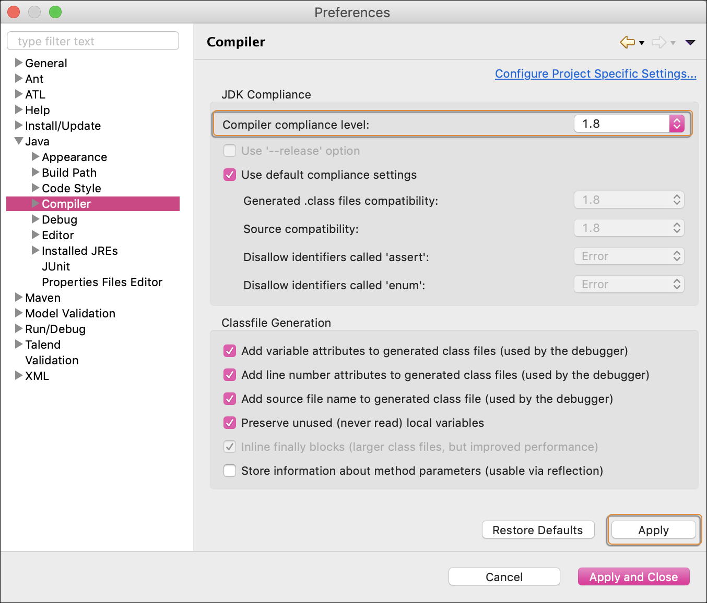
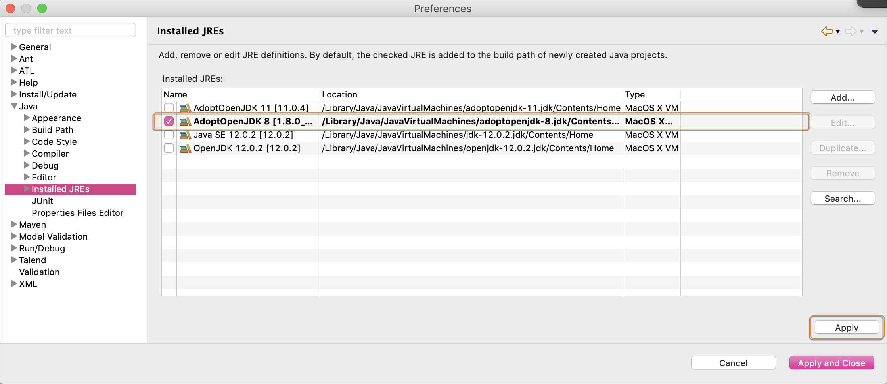
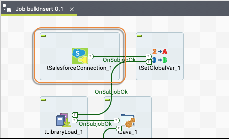
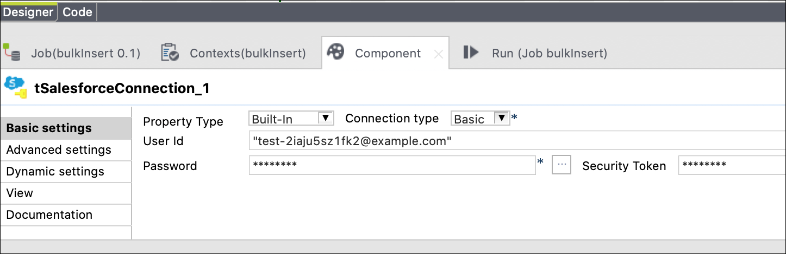
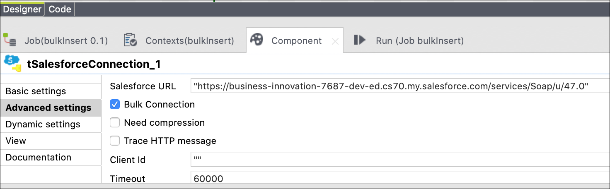
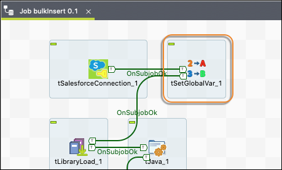
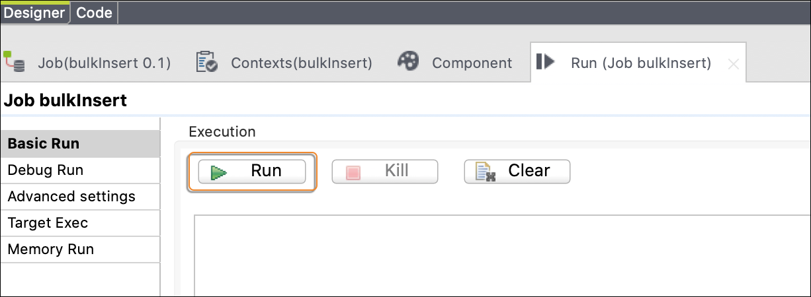

# Use Talend to Import Common App Data into Salesforce

If you’re a Common App member school looking to import applicant data into Education Data Architecture, use these sample Talend jobs to help you implement your own integration. The provided Talend jobs import Common App First Year applicant data and PDF documents into Salesforce staging records. After the staging records are created, you can run a batch job provided in the TBD package to move the data and PDFs from staging records to EDA records. For more information about the TDB package, see TBD. 

This documentation details what the Talend jobs do and explains how to configure the jobs for your institution. You can use the jobs as is, or you can customize them. You can also use them as reference if you’re using a different ETL tool.

**IMPORTANT**: These Talend jobs are provided as *samples* only. These jobs provide an example of how an ETL tool can be used to import Common App data and stage it in Salesforce. These jobs are *not* an official solution and they are *not* officially supported.

## Job Details

There are two Talend jobs—one for the .csv data file and one for the .pdf files. Both jobs create the required DataStaging records for the TBD package. For detailed information about the staging records, see TBD.

### **CSV Job**

This job parses the First Year applicant tab-delimited .csv file that you exported from Common App to your local computer. Customize the Talend job to go directly to your SFTP server if that’s more convenient for your institution. You must run this job for *every* .csv file you download from Common App. For each row in the .csv file, the job creates these records.

* DataStaging—This record contains information about the data. 
* ContentDocument—This record stores the .json file that includes a flat JSON object.
* ContentDocumentLink—This record relates the ContentDocument record to the matching DataStaging record.

Tip: When you download the applicant data from Common App you get a .txt file. Rename the file to use the .csv extension. 

### **PDF Job**

This job looks in a designated directory on your local computer where you’ve unzipped the .pdf files downloaded from Common App. For every .pdf file in the directory, the job creates these records.

* DataStaging—This record contains information about the .pdf file. If the .pdf files are in the same daily export and belong to the same applicant, a single DataStaging record can be shared between multiple .pdf files.
* ContentDocument—This record stores the .pdf file. 
* ContentDocumentLink—This record relates the ContentDocument record to the matching DataStaging record.

## Job Prerequisites

* Install Java 8 or Java 11. Run `/usr/libexec/java_home -V` to check your version.
* Update your Talend Java preferences. 
    * Select **Java** > **Compiler**. For the Compiler compliance level setting, select **1.8** or **11**. Click **Apply** to save your settings. 
    
    * Select **Java** > **Installed JREs**. In the Installed JREs table, select **AdoptOpenJDK 8** or **AdoptOpenJDK 11**. Click **Apply** to save your settings. 
    
* Download and unzip the [COMMON_APP_FIRST_YEAR](COMMON_APP_FIRST_YEAR.zip).zip file

## Update the Job’s Salesforce Connection

To use the Talend jobs, update the Salesforce connection. Complete these steps for *each* job. 

1. Open the Talend job in the designer window. 
2. Scroll to the top and double-click the Salesforce Connection component.

3. On the Component tab in Basic Settings, enter the credentials of a user in your Salesforce org that has permission to create DataStaging records. This user must have read and edit permissions on all of the DataStaging fields. Ensure you’re on VPN so that you won’t need to enter a security token. **Note**: If you install the TBD package, you can assign your integration user the TBD permission set which includes access to the DataStaging fields. 

4. Enter Cmd+S to save your change. 
5. Click on **Advanced Settings**, update the Salesforce URL field with the URL for your Salesforce instance. This URL must be surrounded in double quotation marks and end with `/services/Soap/u/47.0`. 

6. Enter Cmd+S to save your change. 

## Edit the CSV Job’s Global Variables

To use the CSV job, update its Global Variables. 

1. On your computer desktop, create this folder structure. 
    `Desktop/CommonApp/bulkFiles/Output
    `
2. Open the CSV job in the Talend designer window. 
3. Scroll to the top and double-click the Salesforce Global Variables component. 

4. On the Component tab in Basic Settings, edit these global variables. To edit a value, double click on the Value column of the row. Make sure to wrap your values in double quotation marks. When you’re done, enter Cmd+S  to save your changes.

|
**Variable Name (Key)** |
**Expected Value**  |
|---    |---    |
|delimitedCAFile    |Enter the absolute path to the tab-delimited .csv file that contains the data exported from Common App.

Example: `"/Users/intgUser/Desktop/CommonApp/CommonAppSuspects.csv"`    |
|delimitedStagingOutput |Enter the absolute path to a file that Talend can use for tracking the DataStaging records that it will bulk import into Salesforce. The path to the file must exist on your computer, but the file itself need not already exist. In other words, if you want to have this temporary file created in your Desktop directory, enter the absolute path to Desktop. Then add a file name and extension to the end of the path. If no file exists with the name and extension you provided, Talend creates the file for you.

Example: `"/Users/intgUser/Desktop/CommonApp/bulkFiles/stagingRows.csv"`    |
|bulkInsertOutputFile   |Enter the absolute path to a file that Talend can use for outputting the results of the DataStaging records that it bulk inserts into Salesforce. The path to the file must exist on your computer, but the file itself need not already exist. In other words, if you want to have this temporary file created in your Desktop directory, enter the absolute path to Desktop. Then add a file name and extension to the end of the path. If no file exists with the name and extension you provided, Talend will create the file for you.

Example: `"/Users/intgUser/Desktop/CommonApp/bulkFiles/Output/dliOutput.csv"`   |
|batchType  |Update this field based on the type of .csv file you're using. For Recommender .csv files, change it to `"Recommender"`. For all other .csv files, change it to `"First Year"`.    |

## Edit the PDF Job’s Global Variables

To use the PDF job, update its Global Variables. 

1. On your computer desktop, create this folder structure if you haven’t already. 
    `Desktop/CommonApp/bulkFiles/Output
    `
2. Open the PDF job in the Talend designer window. 
3. Scroll to the top and double-click the Salesforce Global Variables component. 

4. On the Component tab in Basic Settings, edit these global variables. To edit a value, double click on the Value column of the row. Make sure to wrap your values in double quotation marks. When you’re done, enter Cmd+S  to save your changes.

|
**Variable Name (Key)** |
**Expected Value**  |
|---    |---    |
|pdfDirectory   |Enter the absolute path to the directory that contains the unzipped .pdf files that you exported from Common App.

Example: `"/Users/intgUser/Desktop/CommonApp/pdfs/"`    |
|delimitedStagingOutput |Enter the absolute path to a file that Talend can use for tracking the DataStaging records that it will bulk import into Salesforce. The path to the file must exist on your computer, but the file itself need not already exist. In other words, if you want to have this temporary file created in your Desktop directory, enter the absolute path to Desktop. Then add a file name and extension to the end of the path. If no file exists with the name and extension you provided, Talend creates the file for you.

Example: `"/Users/intgUser/Desktop/CommonApp/bulkFiles/stagingRows.csv"`    |
|bulkInsertOutputFile   |Enter the absolute path to a file that Talend can use for outputting the results of the DataStaging records that it bulk inserts into Salesforce. The path to the file must exist on your computer, but the file itself need not already exist. In other words, if you want to have this temporary file created in your Desktop directory, enter the absolute path to Desktop. Then add a file name and extension to the end of the path. If no file exists with the name and extension you provided, Talend will create the file for you.

Example: `"/Users/intgUser/Desktop/CommonApp/bulkFiles/Output/dliOutput.csv"`   |
|batchType  |Set this value to `"First Year"`.  |

## **Run the Jobs**

After you’ve configured the Talend jobs and exported your Common App data and .pdf files to the locations specified in the Global Variables, you’re ready to run the jobs. Complete these steps for *each* job. 

1. Open the Talend job and click the **Run** tab. 
2. Click **Run**.

The job makes a connection to Salesforce, parses the .csv file or .pdf files and creates the required DataStaging records. If any errors occur while the job runs, they show up in the large text area below the Run button.

You can run the Talend job manually or you can set it up to run daily. The frequency is up to you. 
